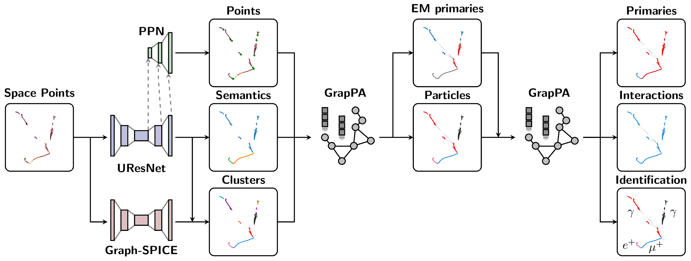

SPINE Documentation
===================

.. rst-class:: lead

`Scalable Particle Imaging with Neural Embeddings (SPINE) <https://github.com/DeepLearnPhysics/spine>`_ is a machine-learning reconstruction toolkit for particle imaging detectors, developed primarily for Liquid Argon Time Projection Chambers (LArTPCs). It combines configuration-driven I/O, deep neural network models, object construction, post-processing, analysis, and visualization into a single reconstruction workflow. The schematic below breaks down the full end-to-end reconstruction flow.

For full reconstruction, training, and inference workflows, SPINE is intended to run from the published SPINE container image released alongside each SPINE version. Use the release-tagged image ``ghcr.io/deeplearnphysics/spine:<release>`` when reproducibility matters. When in doubt, use ``ghcr.io/deeplearnphysics/spine:latest`` or omit the tag entirely, which is equivalent in Docker-style image references. Docker is the usual path on local machines; Apptainer or Singularity is the usual path on HPC systems. A local ``pip`` installation is most appropriate when you only need post-processing, analysis, visualization, or lightweight data inspection.

The package is organized around the :class:`spine.driver.Driver` pipeline:

- load detector inputs and labels
- run neural network inference or training
- unwrap batched outputs
- construct fragments, particles, and interactions
- apply post-processing and detector matching
- run analysis scripts and write results

.. toctree::
   :maxdepth: 2
   :caption: Contents:
   :hidden:

   Introduction <self>
   installation
   quickstart
   pipeline
   data_model
   config_loader
   api/index

Getting Started
===============

The landing page should stay short and decision-oriented. The detailed setup and workflow instructions live in the dedicated guides linked below.

Installation
------------

For complete SPINE workflows, start from the released SPINE container image:

.. code-block:: bash

   # Equivalent to omitting the tag entirely
   docker pull ghcr.io/deeplearnphysics/spine:latest

   # Use an explicit release tag when you want a pinned runtime
   docker pull ghcr.io/deeplearnphysics/spine:<release>

On HPC systems, pull the same released image through Apptainer or Singularity:

.. code-block:: bash

   # Equivalent to omitting the tag entirely in the Docker image reference
   apptainer pull spine_latest.sif docker://ghcr.io/deeplearnphysics/spine:latest

   # Or pin to a specific release
   apptainer pull spine_<release>.sif docker://ghcr.io/deeplearnphysics/spine:<release>

For local ``pip`` installs, development workflows, and the full runtime discussion, see :doc:`installation`.

For lightweight data inspection and analysis, install the core package directly:

.. code-block:: bash

   python -m pip install spine

Add the visualization dependencies if you want to use :mod:`spine.vis`:

.. code-block:: bash

   python -m pip install "spine[viz]"

Quick Start
-----------

The quickest local workflow is to inspect an HDF5 file previously produced by
SPINE. The example below expects reconstructed particles together with their
``points`` and ``depositions`` products. Save this minimal configuration as
``inspect.yaml``:

.. code-block:: yaml

   base:
     iterations: -1

   io:
     reader:
       name: hdf5
       file_keys: /path/to/spine_output.h5
       keep_open: false

   build:
     mode: reco
     units: cm
     fragments: false
     particles: true
     interactions: false

Load one entry, rebuild the long-form particle representation, and draw it:

.. code-block:: python

   from spine.config import load_config_file
   from spine.driver import Driver
   from spine.vis import Drawer

   cfg = load_config_file("inspect.yaml")
   data = Driver(cfg).process(entry=0)

   drawer = Drawer(data, draw_mode="reco")
   fig = drawer.get("particles")
   fig.show()

The ``build`` block is important: the HDF5 reader restores the serialized
particle records, while the builder reconnects their point, deposition, and
index data for downstream consumers such as :class:`spine.vis.Drawer`.

For model training and inference, run SPINE from the released container with a
compatible LArCV input file and configuration:

.. code-block:: bash

   # Using the newest published image
   docker run --gpus all -v $(pwd):/workspace \
     ghcr.io/deeplearnphysics/spine:latest \
       spine --config /workspace/config/full_chain/full_chain_regression.yaml \
       --source /workspace/input.root

   # Or use a pinned release image
   docker run --gpus all -v $(pwd):/workspace \
     ghcr.io/deeplearnphysics/spine:<release> \
       spine --config /workspace/config/full_chain/full_chain_regression.yaml \
       --source /workspace/input.root

On Apple Silicon macOS systems, pass ``--platform=linux/amd64`` to ``docker
run`` when using the published SPINE image. For Jupyter notebook/lab use,
avoid the Docker Desktop combination of Apple Virtualization Framework **with**
Rosetta enabled; Apple Virtualization Framework without Rosetta and Docker VMM
have both been verified to work.

For the full interactive-container workflow, Apptainer examples, and the longer Python walkthrough, see :doc:`quickstart`.

SPINE also exposes lower-level modules for data structures, model components, construction, analysis, math helpers, and visualization, but the main user-facing workflow starts from the driver and configuration system.

Indices and tables
==================

* :ref:`genindex`
* :ref:`modindex`
* :ref:`search`
